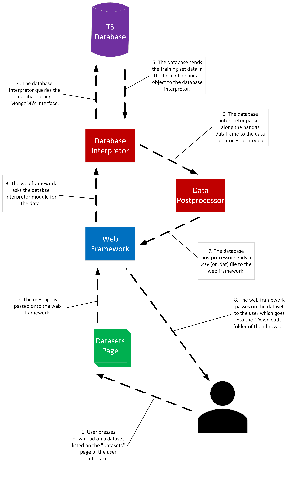
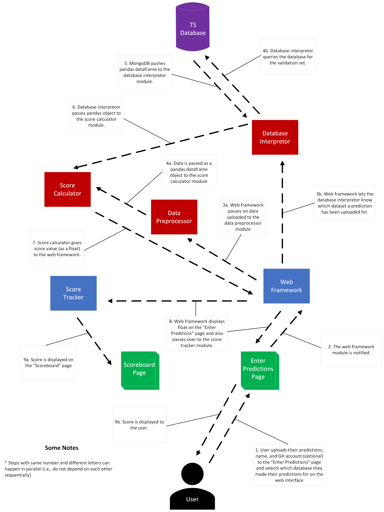
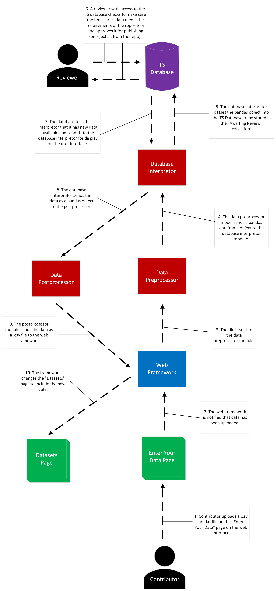

Dynamic Models of Operational Scenarios
========================================

There are three use cases that are detailed in the system requirements specification for DATSR. The design for the operation of each of these use cases is described visually below. For the sake of continuity, the color coding of the individual modules follows the same key as the high resolution software architecture diagram shown above (:numref:`soft-arch-hi`).

The first diagram (:numref:`use-case-1`) shows how our application is able to provide users with the ability to download data sets from the web interface.

   Use Case #1 (Retrieving Time Series Data)

.. raw:: latex

   \clearpage

The diagram below (:numref:`use-case-2`) shows how a user can upload their predicted values and receive a score after they have downloaded the training portion of a time series data set.

   Use Case #2 (Uploading Predictions)

.. raw:: latex

   \clearpage

The next diagram (:numref:`use-case-3`) is a visualization of the process in which a contributor can add a time series data set to the repository.

   Use Case #3 (Adding Data to the Repository)

.. raw:: latex

   \clearpage