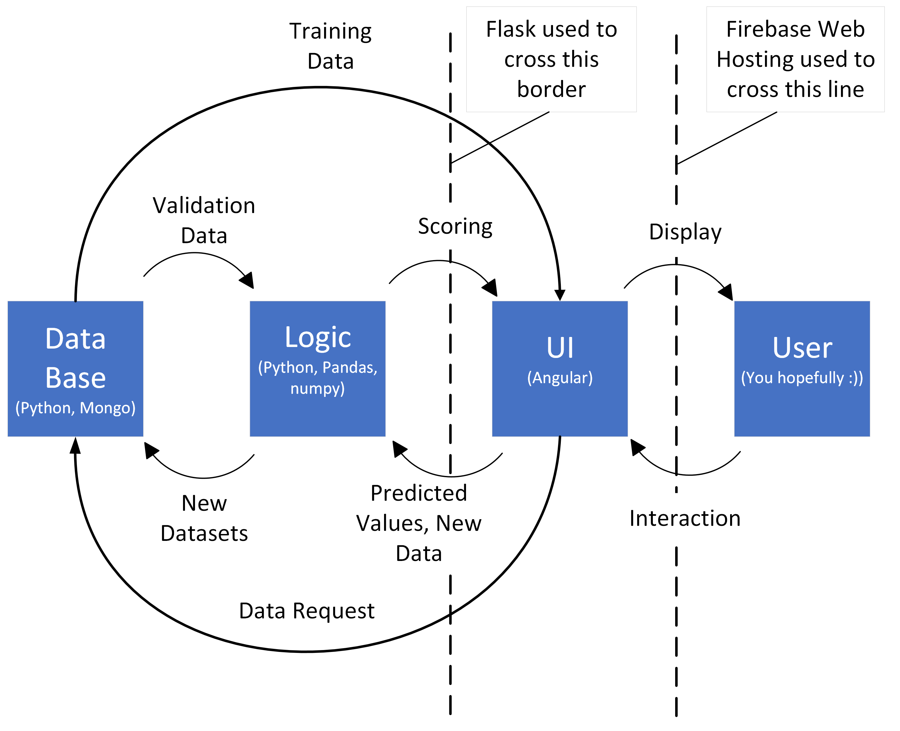
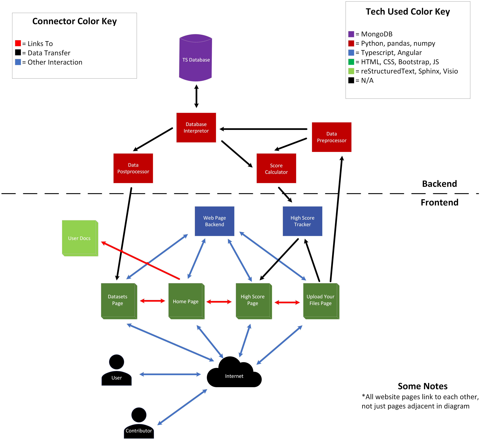

Software Architecture
=====================

The architecture of the software behind our application can broadly be split into three categories: the user interface (i.e. the front-end), the "logic" scripts, and the database/database interpretor. 

The users interact with the front-end which primarily uses technologies like Angular, Typescript, HTML, CSS, and Bootstrap. When these user interactions need data processed or calculations done, the work is outsourced to the "logic" section of our program which is primarily implemented in Python using libraries such as pandas and numpy. Finally, the database section of our modules stores and handles the time series data for the application.

Therefore, we could visualize the software architecture in lower resolution using the diagram below (:numref:`soft-arch-lo`).

   Software Architecture (Low Resolution)

.. raw:: latex

   \clearpage

This "category" view of the application may be too broad for some, in which case one can refer to the more detailed modular view of the application below (:numref:`soft-arch-hi`).

   Software Architecture (High Resolution)

.. raw:: latex

   \clearpage

In order to elaborate further on the components of that make up this diagram, the following table lists all the modules and sub-modules referenced above, their functionality, and what "category" they fit into in the broader scheme.

.. list-table:: Software Architecture Modules and Sub-Modules
   :name: software-architecture-modules-and-sub-modules
   :class: longtable
   :widths: 30 20 50

   * - **Module/Sub-Module**
     - **Category**
     - **Functionality**
   * - TS Database
     - Database
     - Stores time series datasets as well as metadata that describes them.
   * - Database Interpretor
     - Database
     - Creates an interface between python and MongoDB which allows for inputting and extracting data from the DB when needed.
   * - Data Preprocessor
     - Logic
     - Formats data from contributors so that it can be transferred into the database.
   * - Data Postprocessor
     - Logic
     - Formats data taken from the DB so that it can be downloaded by end-users.
   * - Score Calculator
     - Logic
     - Uses statistical error equations to create a "rating" for the effectiveness of a user's predictions generated for a particular data set.
   * - Home Page
     - UI
     - Introduces end-users to the application, gives basic information about the project and the team, and provides links to navigate to other pages in the user interface.
   * - Datasets Page
     - UI
     - Displays a list of available time series data sets with descriptions of their key features. Allows users to download .csv files of data sets they wish to use.
   * - Upload Your Files Page
     - UI
     - Allows users to contribute to time series data sets to the repository and provides an interface so that end-users can get feedback on their predictive models without revealing the validation set of the time series data.
   * - High Scores Page
     - UI
     - Shows users how other predictive schemes have performed on the data provided in the repository.
   * - User Docs
     - Documentation
     - Guides users through using the application.

What makes this system operational is not just the individual components, but their interactions with each other. Although the two diagrams above give some idea of the interactions we see in our system, we can elaborate on some key points to further elaborate on our design.

One key interaction is between the database interpretor module and the data pre-/post- processing modules. These interactions consist of data transfer which allows TS data to pass between the database and the end-users in the correct format. Another interaction that is prominent in the second diagram above (:numref:`soft-arch-hi`) is the linking between different pages of the User Interface as well as to the user documentation. This interaction is important because it creates navigability across the application and adds to the intuitive nature of the user interface. Finally, we can look at the key interaction between the backend scoring script and the frontend scoring pages. These interactions consist of data transfers as well as control instructions which allow calculation to be done by the score calculator module and have the user interface react appropriately to the results of those calculations.

The architecture choices that resulted in the system design we see above were made with the primary functionality of the application in mind. Our mission was to effectively create a pipeline for users to access and contribute to our repository of time series data sets. The way our application is set up, users simply have to interact with the intuitive UI in a manner specified in the documentation and the rest is handled by behind-the-scenes modules that process, format, and move around the data. Our decision to hierarchically implement the system in terms of areas (front-end vs back-end), categories (database, logic, UI), and modules allows for modifiability and flexibility. 

