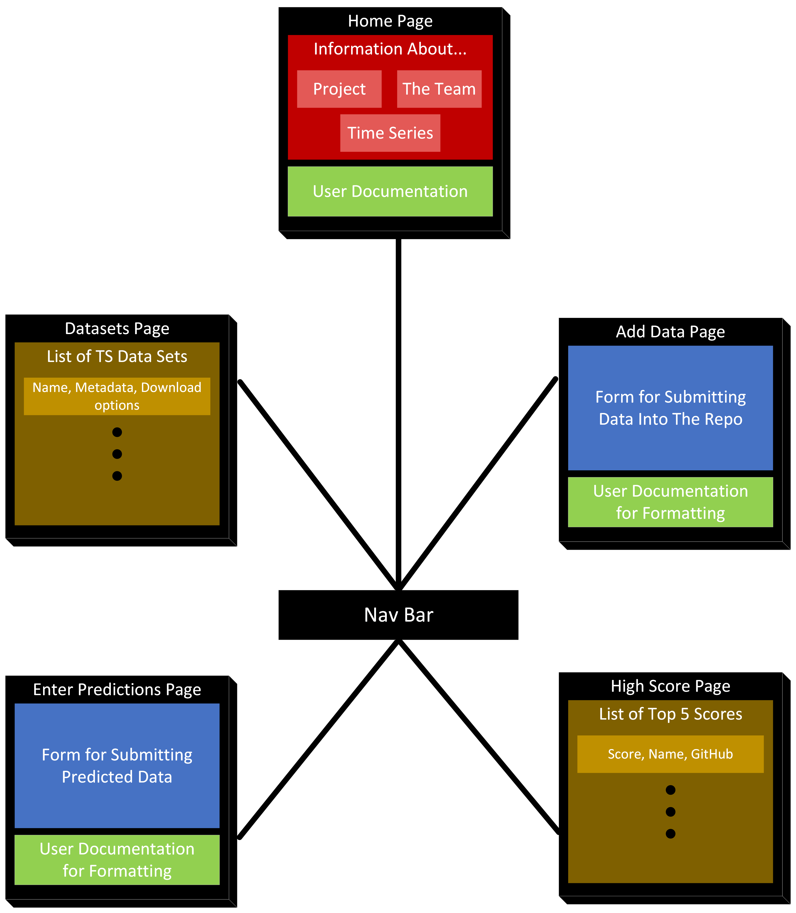
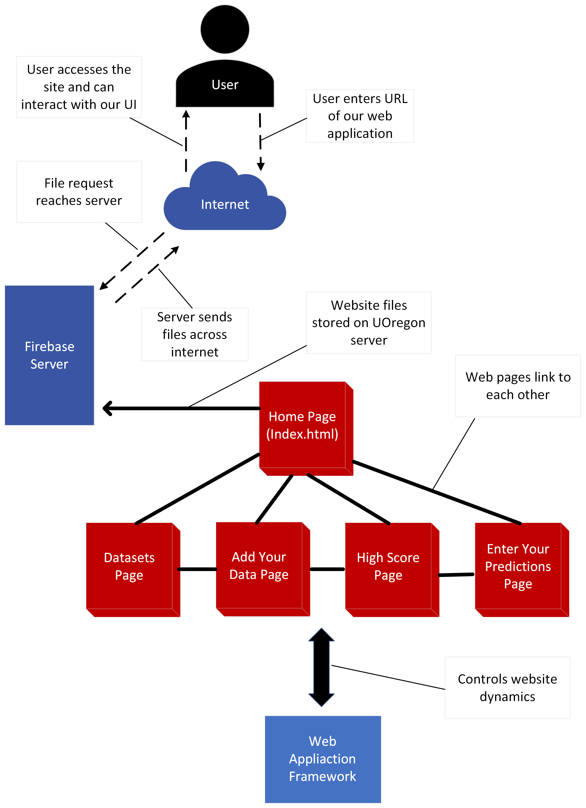
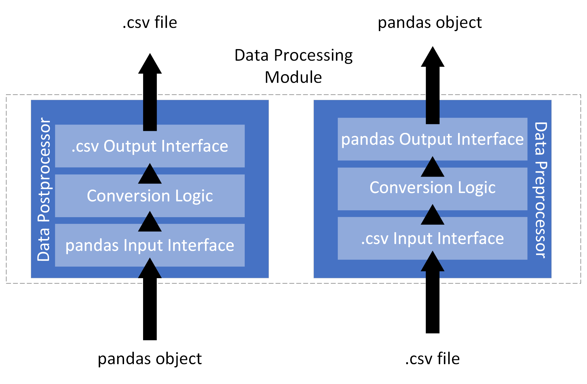
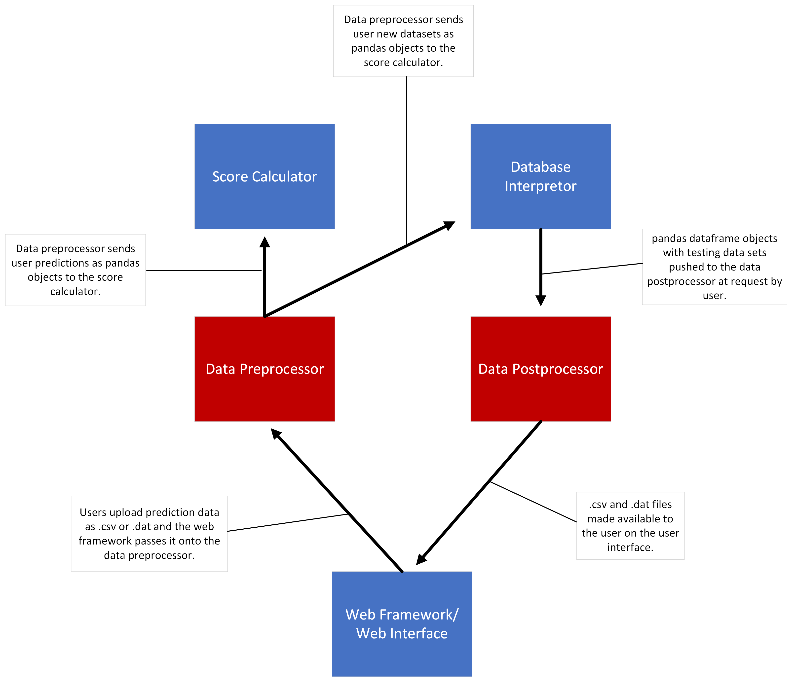
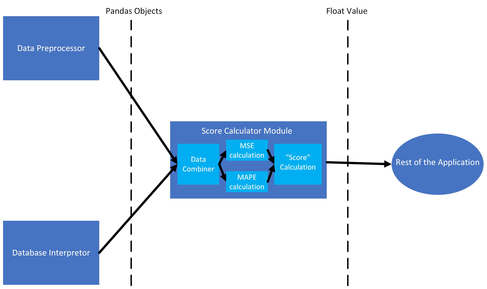
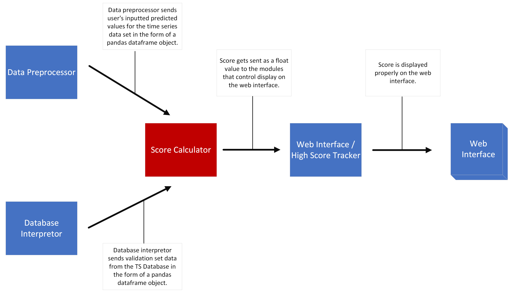
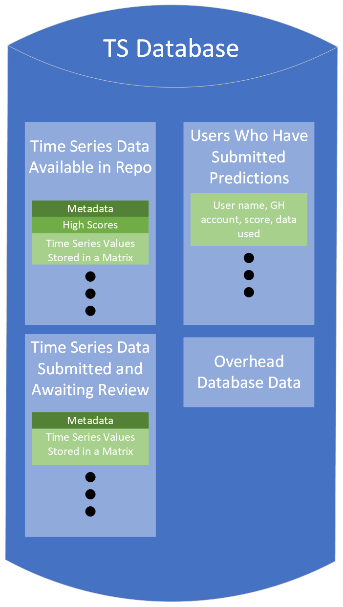
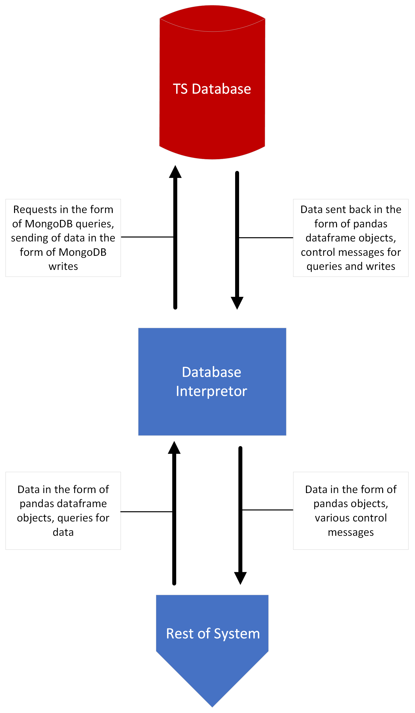
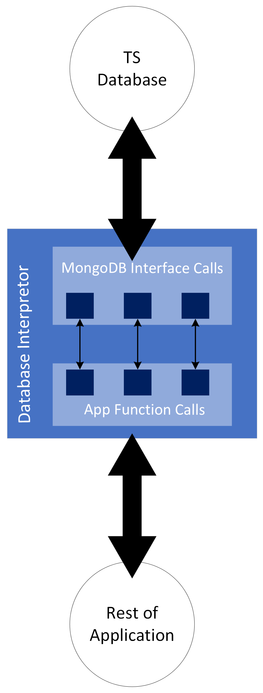
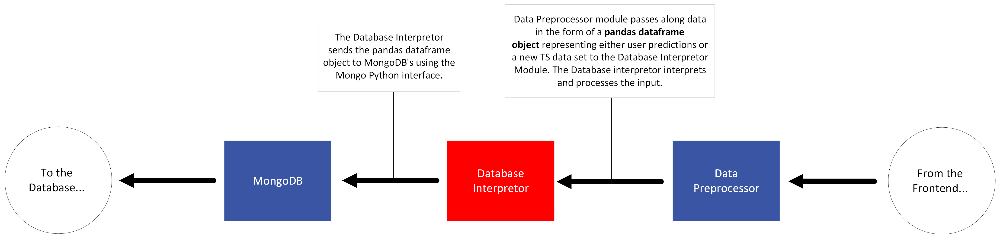

Software Modules
=================

Web Interface
-------------------

This module's primary function is to provide the user an interface through which they can interact with our application. Specifically, it allows them to access and add to the TS data in our repository as well as test predictive models and compare results with other users.

The structure of this module can be visualized with the following static model.

   Static Model of Web Interface

.. raw:: latex

   \clearpage

This module interacts with the typescript code that makes up the framework that the site is built upon. It controls interactions between the pages, passes on requests to reach any back-end modules, and updates the user-facing pages with generated HTML and CSS code. This module is also the primary component of the application that interfaces with end-users. End-users are able to reach the web interface through any browser and from there they can interact with the application using options provided on the web UI.

To further show how this module interacts with other parts of the system, we can look to the following dynamic model (:numref:`web-ui-dynamic`):

   Dynamic Model of Web Interface

.. raw:: latex

   \clearpage

The rationale behind the design decisions for the web interface is primarily familiarity. Separate pages with a navigation bar to link them is familiar to most Internet users, making navigation and comprehension intuitive. Our reasoning with the technologies we choose was that our team had familiarity with Angular and Angular provided us with all the functionality we needed.

The reason we favored this design over others is that it provided the most straight forward user interface. More intricate user interfaces could be made with other technologies, but with our design users are only provided with what they need. This simplifies user documentation, increases loading speeds, and optimizes efficiency for users.

This module can be divided into five sub-modules which are listed below.

Home Page
############

The purpose of the home page is to welcome the user to the application and orient them to the website interface. Specifically it allows them to easily navigate to other pages and learn more about the project if they so choose. Furthermore, the home page links directly to user documentation, which is a thorough guide to using the app.

Datasets Page
##############

This page displays a list of time series data sets which are available to download in the form of .csv files. Information about each data set is displayed on this page including the number of variables, the number of data-points, and the domain that the data comes from. 

High Score Page
#################

This part of the web interface allows users to see how their predictive methods compare to peers who also use the repository. Users can see a high score list for each individual data set. They are ranked in terms of a "score" which is calculated using an equation specified in the "Score Calculator" section below (:numref:`score-calc`).

Enter Predictions/Data Page
#############################

Here users can enter predicted values that they have generated for time series data sets taken from the repository and receive feedback from the application. They can also upload new data sets that they wish to be included in the repository in the future.

Data Processing
-----------------------

This module acts a mediator between modules by formatting their data outputs so that they can be interpreted as inputs for other parts of the system. The structure of this component can be visualized statically in the diagram shown below.

   Static Model of Data Processing Module

.. raw:: latex

   \clearpage

However the static model above doesn't do the best job at showing the purpose of this module as a middle ground for transporting data throughout the system. The data processing section of the application receives inputs from both the database interpretor module and the web framework module. The former is in the form of database data which it then processes to be in a format accessible to users of the web interface; while the latter is the opposite--it takes user formatted data and makes it readable by the MongoDB database. As a "mediator," the data processing module outputs to the same modules it receives inputs from. The dynamic model below shows this situation in a more visual fashion:

   Dynamic Model of Data Processing Module

.. raw:: latex

   \clearpage

The design decision to include this module was a clear one because MongoDB's BSON data type is not very accessible to the target users of our application, so accepting other data types was essential. The splitting of this module into two separate components made development much more straightforward as we could focus on a single data translation paradigm (i.e., .csv to BSON or BSON to .csv).

Other design options that were considered were primarily in the realm of what data types should be accepted and what the "mediator" data type should be. For the data types accepted, we considered JSON, .dat, and .txt, but ultimately settled on .csv. These are generally what other TS repositories had their data available in and both are common in many fields of AI/CS research. The "middle-ground" datatype is a pandas dataframe object which we choose due to its plentiful options and thorough documentation. It worked very well with all the Python modules in the backend.

The data processing module of our application can be divided into two sub-modules based on the direction in which data is flowing.

Data preprocessor
###################

This part of back-end system processes time series data inputted as a .csv file and formats it as a pandas object. The pandas dataframe object is then passed on to the database interpretor so that it can be modified to comply with Mongo's python interface.

Data Postprocessor
#####################

This sub-module formats data outputted by MongoDB into .csv files which are given to the front-end modules and made available to the users.

.. _score-calc:

Score Calculator
------------------

This module calculates the "score" of predicted values submitted by users of the repository to give them an idea of how accurate their predictive model was. It uses the following equation to do its calculation:

[equation here]

The following static model displays one view of this component that focuses on its internal structure.

   Static Model of Score Calculator Module

.. raw:: latex

   \clearpage

To further elaborate on the interface of this module with the rest of the system, we can split the interactions into two categories: inputs and outputs. The score calculator receives inputs from the data preprocessor and database interpretor. The inputs come in the form of pandas dataframe objects. The output comes in the form of a float values representing the "score" calculated using the equation above as well as the individual statistical values that were compiled to generate the "score." The modules which receive the score value are the web framework and the score tracking module, which eventually makes its way to the web interface to be displayed properly. 

The dynamic model of the score calculator (shown below) shows this module's interface in a more visual way:

   Dynamic Model of Score Calculator Module

.. raw:: latex

   \clearpage

The design decisions of this module were made primarily with statistics in mind. The language and libraries used are popular in data science (Python, pandas, numpy) and the equations used in calculation are common error measures across many fields. 

Other design decisions were considered; however, we favored this approach because it aligns with the needs of our users. ML engineers and academic researchers use evaluation schemes that are heavily based on classical statistics and so we wanted to comply with industry and research standards when building this module.

TS Database
-----------------

This module stores the time series data that is offered as the main service of the repository. It also contains meta data about the data sets that are stored including the number of variables, the number of data points, and the domain that the data comes from. 

Three other collections exist within the database as well: an archive of users who have submitted predictions, the scores of each dataset, and a queue of additions to the repository that have not yet been approved by a reviewer in the system. These provide further functionality in the app including tracking scores and growing the repository's data set.

We can see a visualization of this compartmentalization of the TS database with the following static model:

   Static Model of TS Database Module

.. raw:: latex

   \clearpage

The interactions that this module has with the rest of the system are very straightforward due to the existence of the "database interpretor module" whose sole purpose is to interface with the database using procedures defined by MongoDB's Python library. The following dynamic model for the TS database module goes into further detail about the interface between the interpretor and database.

   Dynamic Model of TS Database Module

.. raw:: latex

   \clearpage

This module was implemented using MongoDB, python, and python libraries (primarily pandas). Many of the design decisions around the TS Database were made with these technologies in mind--playing to their strengths and accommodating to the way they interact with other technologies. Furthermore, our design decisions allowed for greater usability for us as developers. This was key as we are a team of somewhat inexperienced programmers.

Many other designs were considered, but the primary alternative we looked at was a relational database such as SQLite. Ultimately, we decided that a non-relational database would be preferable because of its more straightforward interface with Python and its more intuitive data formatting protocols.

Database Interpretor
---------------------

The purpose of this module is to query the database when data is needed by users and to write data into the database when contributors want to expand the repository. This module is essential to the system because it allows the TS Database (which provides the primary functionality of the repository) to be incorporated smoothly into the application. 

The database interpretor is essentially defined by its interface with other modules. However, a static model of the module can be used to give a better idea of how the interpretor is structured. The diagram below shows such a model:

   Static Model of Database Interpretor Module

.. raw:: latex

   \clearpage

The interface that this module has with other modules is defined by the interactions the TS database requires in the application. Because of this, we can think of the MongoDB database as the primary module it interacts with in the form of reads and writes compatible with MongoDB's Python interface. 

On the other side of the application, the interpretor receives incoming data transmissions from the data preprocessor (this is because data must be formatted as a pandas object before being moved into the TS database). In addition to TS data, the database interpretor is given updates for the scoreboard from the Web framework. The database interpretor also receives control message inputs from the web framework when a validation set is needed in order to calculate a user's score. 

In terms of outputs, the database interpretor transfers data to the data postprocessor when it needs to be transferred directly to users and to the score calculator when it will be used to create a score value. The interpretor also sends information directly to the frontend framework in some cases--specifically for the high scores page.

   Dynamic Model of Database Interpretor Module

The design of this module was created with ease of interface in mind. Because the database interpretor acts primarily as a conduit to the TS database storage, we wanted to make this module efficiently interact with MongoDB as well as the modules on the other side of the application. 

When designing this module, we considered using a more command line oriented approach that is supported by MongoDB. However, the python interface libraries provided by Mongo were more than enough to create effective passages of information and control messages. Furthermore, by staying in the domain of Python code it was easier to integrate this module with the rest of the backend which was also primarily written in Python.